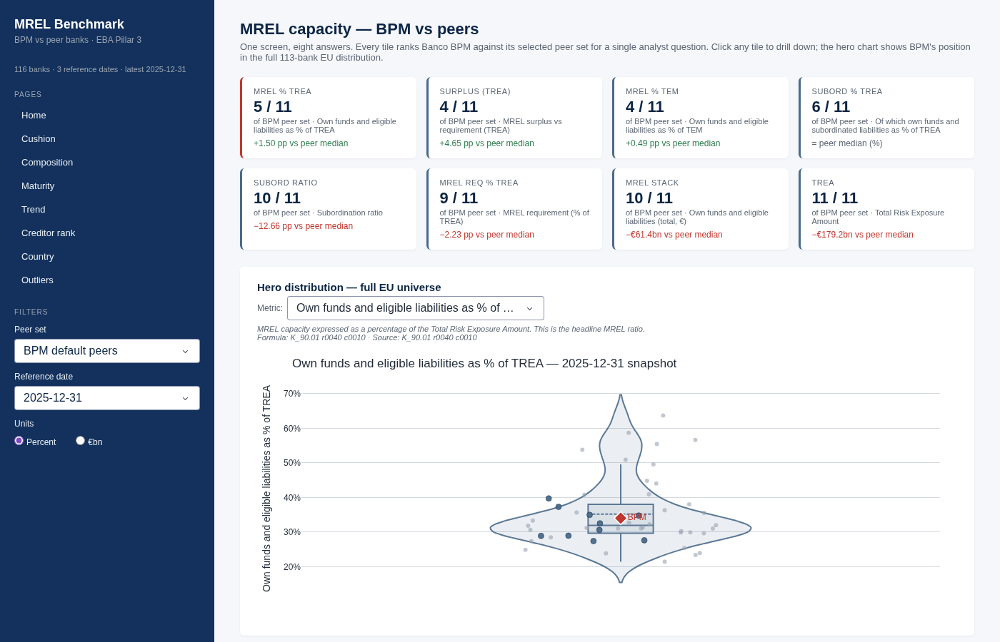
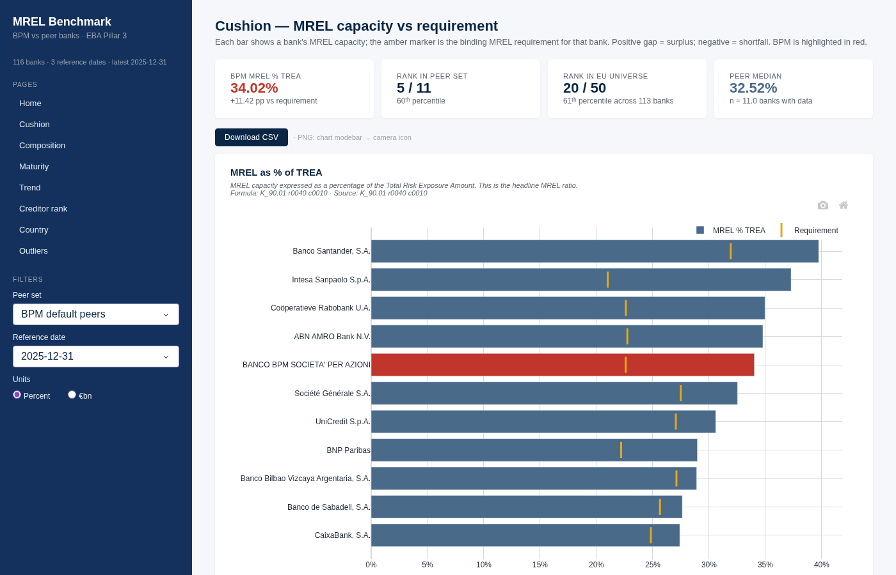
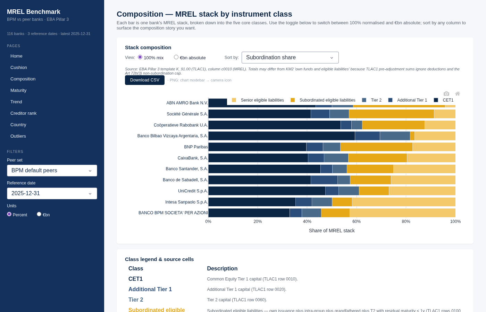
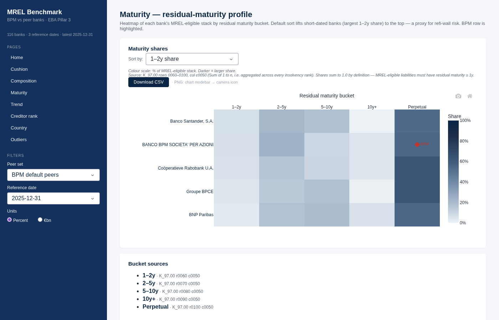
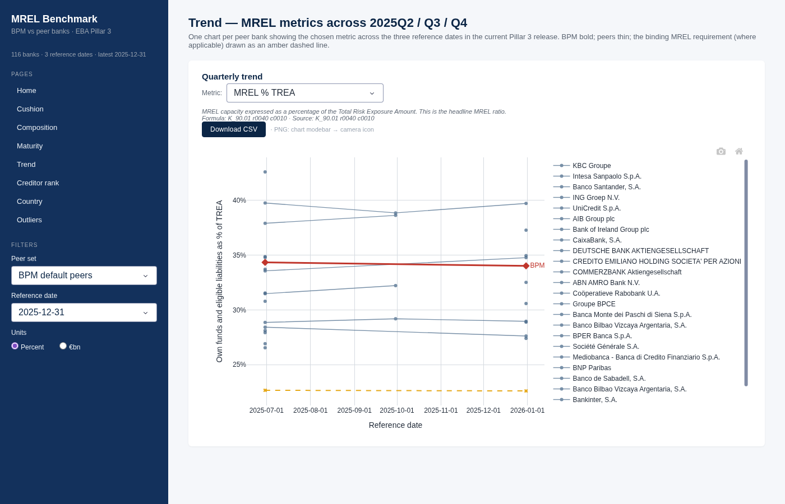
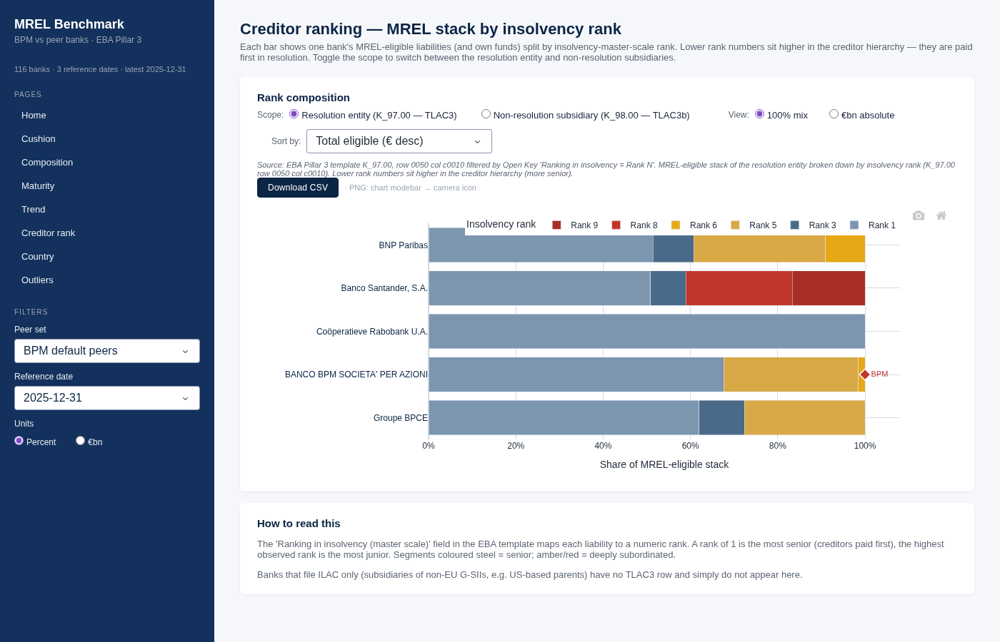
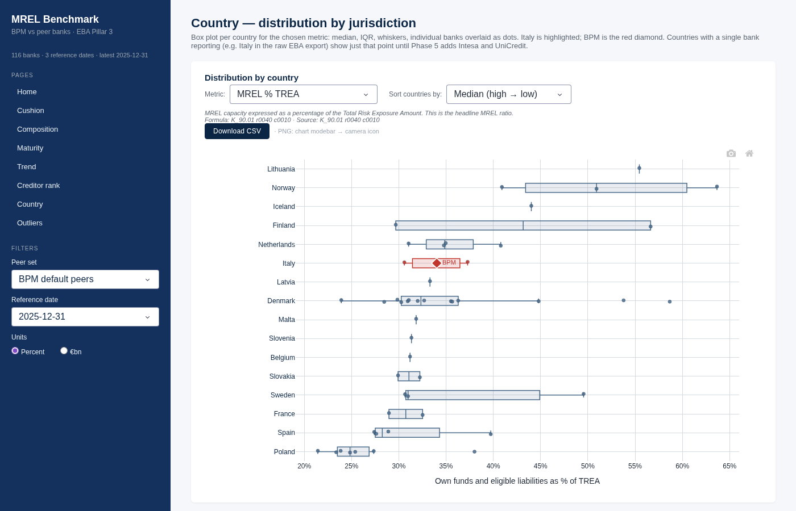
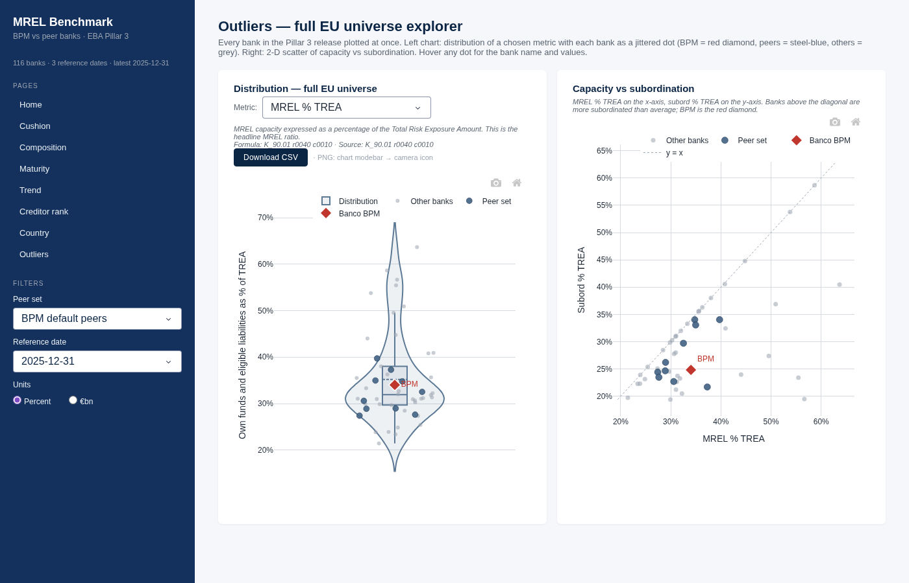

# mrel-peer-benchmark

[](https://github.com/enrdefilippis-bas/mrel-peer-benchmark)
[](https://www.python.org/)
[](https://fly.io/)

Cross-bank **MREL capacity benchmarking** tool built on official EBA Pillar 3
disclosures (EU KM2, EU TLAC1, EU TLAC3/TLAC3b, ILAC). Anchored on
**Banco BPM** as the reference bank, with peer comparison against a tight
default peer set and an outlier explorer over the full EU universe.

Unlike the aggregate dashboards published by EBA and SRB, this tool
benchmarks individual banks against each other on composition, residual
maturity, subordination and quarterly trend.

## What's in the box

- **8 analyst pages** — Home hub, Cushion (Q1), Composition (Q2/Q4),
  Maturity (Q3), Trend (Q5), Creditor ranking (Q6), Country (Q7), Outliers
  (Q8).
- **Every metric self-documents** — hovering any tile, bar or tooltip shows
  the formula and the exact Pillar 3 source cell (e.g. `K_90.01 r0040 c0010`).
- **Per-page CSV + PNG export** — one click from each drill-down page.
- **Stable peer set** — banks missing from the Pillar 3 release stay
  visible but greyed-out, so the peer-set size never silently drifts.

## Data sources

- **Primary:** EBA Pillar 3 cell-level export
  (`data/raw/p3mreldata_2025q4.xlsx`) — 112 banks, 27 countries, 8 templates,
  quarterly (2025-06-30, 2025-09-30, 2025-12-31).
- **Supplementary:** Automated PDF parsing (Intesa Sanpaolo, UniCredit, BBVA,
  Crédit Agricole S.A., Société Générale) via `ingestion/missing_banks/` 
  parsers, with fallback to manual-entry JSON files in `data/manual_entries/` 
  if needed.

## Setup

Requires Python 3.13+ (tested on 3.14).

```bash
git clone https://github.com/enrdefilippis-bas/mrel-peer-benchmark.git
cd mrel-peer-benchmark
python3 -m venv venv && source venv/bin/activate
pip install -r requirements.txt
```

## Run

```bash
# 1. Ingest: EBA export + any populated manual-entry JSONs → parquet.
python scripts/ingest.py

# 2. Serve the Dash app.
python -m app.app
# → open http://localhost:8050
```

Re-run `scripts/ingest.py` whenever a new `p3mreldata_*.xlsx` is dropped in
`data/raw/` or a manual-entry JSON is filled in.

## Adding a missing bank

Missing banks are ingested via automated PDF parsers in `ingestion/missing_banks/`.
For banks with native parsers (Intesa, UniCredit, BBVA, Crédit Agricole, Société Générale), 
ensure the Pillar 3 PDF is available in `data/raw/pdfs/<bank_name>/` and 
run `python scripts/ingest.py`.

As a fallback, manually populate JSON files under `data/manual_entries/` 
(one per bank: `intesa.json`, `unicredit.json`, …). Ratios are stored as decimals 
(`0.3402 = 34.02%`), amounts in EUR. See `data/manual_entries/README.md` for details.

Precedence rule: the EBA export always wins on an LEI overlap. A manual
entry for a bank already present in the EBA release is silently dropped.

## Peer sets

- **`default`** — BPM's natural peer group (Italian SIs, European mid-caps,
  selected G-SIBs). Declared in `core.peers.DEFAULT_BPM_PEERS`.
- **Italian SIs**, **EU mid-cap**, **G-SIBs** — presets.
- **Custom** — multi-select any LEI out of the full EU universe.

Peer set size is resolved against the banks present in the current ingest:
if a peer is missing from the Pillar 3 release, the page header reports
`N banks with data / M selected` so the gap is never invisible.

## Fetching Pillar 3 PDFs (dry-run by default)

```bash
python scripts/fetch_pdfs.py              # dry-run — prints URLs
python scripts/fetch_pdfs.py --execute    # actually download
```

Banks often shift PDF URLs each quarter — eyeball the dry-run output before
executing. If a URL is wrong, edit the bank's `pillar3_url_pattern` on its
`BankMeta` or drop the PDF into `data/raw/pdfs/<bank>/` manually.

## Repo layout

```
data/
  raw/                    p3mreldata_*.xlsx + per-bank Pillar 3 PDFs
  processed/              facts.parquet + banks.parquet + ingest_log.json
  manual_entries/         per-bank JSON for banks missing from the EBA export
ingestion/
  eba_export.py           parse p3mreldata_*.xlsx → canonical facts
  bank_dimension.py       build banks.parquet from facts
  missing_banks/          ABC + 5 concrete bank parsers + canonical-cell maps
  normalize.py            merge EBA + per-bank sources (EBA wins on overlap)
core/
  schema.py               canonical facts schema + enums
  metrics.py              derive KM2 / TLAC1 / TLAC3 metrics
  ranking.py              percentile ranks vs peer set + vs universe
  peers.py                peer-set definitions + resolution
  captions.py             single source of truth for formulas + source cells
app/
  app.py                  Dash entry — sidebar + page router
  data.py                 parquet loaders + peer resolution (cached)
  theme.py                navy / amber / red palette + CSS
  components/             peer_selector, tooltip, metric_tile, export_button
  pages/                  home + 7 drill-down pages (Q1–Q8)
scripts/
  ingest.py               end-to-end: EBA + manual entries → parquet + log
  fetch_pdfs.py           dry-run PDF fetcher (use --execute to download)
  capture_screenshots.py   Playwright-based capture of all 8 pages for README
tests/                    pytest — 40/40 green as of Phase 6
docs/
  data-dictionary.md      template cell ↔ metric mapping
  methodology.md          formulas for every derived metric
  screenshots/            filled in by the user post-MVP
```

## Docs

- [`docs/data-dictionary.md`](docs/data-dictionary.md) — which cells map to
  which metrics, and the canonical facts schema.
- [`docs/methodology.md`](docs/methodology.md) — formulas for every derived
  metric (cushion, subordination, composition, maturity, creditor rank).

## Testing

```bash
python -m pytest -q
```

Tests cover: EBA export parsing, metric derivations, ranking edge cases,
peer-set resolution, composition / maturity cell mapping, creditor-rank
breakdown, and the missing-bank PDF-parser pipeline.

## Screenshots

Generate with `python scripts/capture_screenshots.py` (requires the app running locally at `http://localhost:8050`):










## Deploy

Production deploy via Fly.io — see [`DEPLOY.md`](DEPLOY.md) for step-by-step flyctl commands.

## Related work

The sibling project `mrel-analysis` reconciles single-bank prospectus and
Pillar 3 figures for Italian issuers. This project is intentionally
cross-bank only — the two are complementary.
